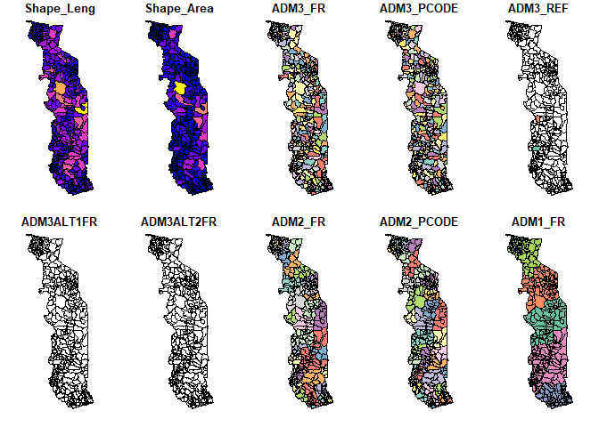
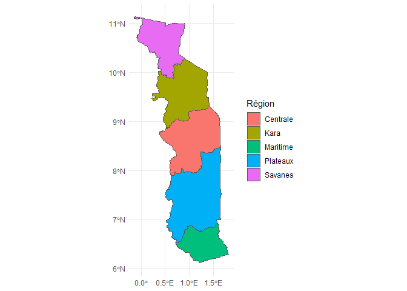
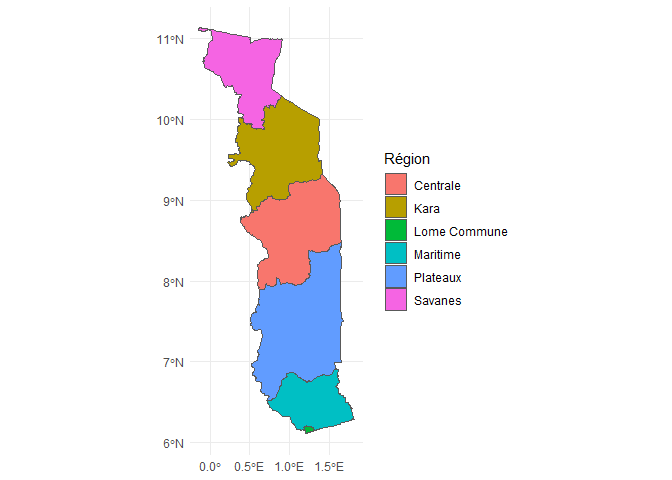
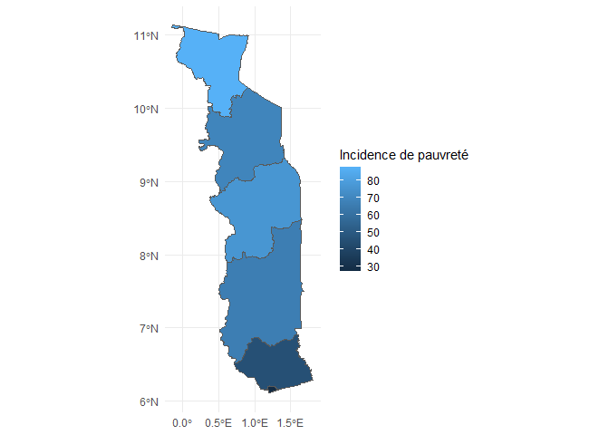

Introduction à la cartographie dans R: fusion de polygones
================
Richard Amegble
2024-02-23

## Introduction

Dans ce Tutoriel nous allons apprendre:

- Comment faire un map avec ggplot2
- Comment aggréger deux polygones

[Le shapefile du Togo](https://data.humdata.org/dataset/cod-ab-tgo?#)

### Lire le fichier .shp

``` r
shape_file<-"./Shapefiles/tgo_admbnda_adm3_inseed_20210107.shp"
sf_df<-read_sf(shape_file)
```

### Dessiner la fonction `plot` de la librairie de base

``` r
plot(sf_df)
```

    ## Warning: plotting the first 10 out of 16 attributes; use max.plot = 16 to plot
    ## all

<!-- -->

### Dessiner le région avec la librairie ggplot2

``` r
p<-ggplot(data=sf_df)+
  geom_sf(aes(fill=ADM1_FR))+
  labs(fill="Région")+
  theme_minimal()
p
```

<!-- -->
\### Dessiner uniquement sans les découpages municipales

``` r
str(sf_df)
```

    ## sf [373 × 17] (S3: sf/tbl_df/tbl/data.frame)
    ##  $ Shape_Leng: num [1:373] 0.443 0.791 0.33 0.134 0.374 ...
    ##  $ Shape_Area: num [1:373] 0.009171 0.016604 0.003623 0.000863 0.00517 ...
    ##  $ ADM3_FR   : chr [1:373] "Abobo" "Adeta" "Adetikope" "Adiva" ...
    ##  $ ADM3_PCODE: chr [1:373] "TG030801" "TG040701" "TG030901" "TG040101" ...
    ##  $ ADM3_REF  : chr [1:373] NA NA NA NA ...
    ##  $ ADM3ALT1FR: chr [1:373] NA NA NA NA ...
    ##  $ ADM3ALT2FR: chr [1:373] NA NA NA NA ...
    ##  $ ADM2_FR   : chr [1:373] "Zio" "Kpele" "Agoe-Nyive" "Amou" ...
    ##  $ ADM2_PCODE: chr [1:373] "TG0308" "TG0407" "TG0309" "TG0401" ...
    ##  $ ADM1_FR   : chr [1:373] "Maritime" "Plateaux" "Maritime" "Plateaux" ...
    ##  $ ADM1_PCODE: chr [1:373] "TG03" "TG04" "TG03" "TG04" ...
    ##  $ ADM0_FR   : chr [1:373] "Togo" "Togo" "Togo" "Togo" ...
    ##  $ ADM0_PCODE: chr [1:373] "TG" "TG" "TG" "TG" ...
    ##  $ date      : Date[1:373], format: "2020-12-16" "2020-12-16" ...
    ##  $ validOn   : Date[1:373], format: "2021-01-07" "2021-01-07" ...
    ##  $ validTo   : Date[1:373], format: NA NA ...
    ##  $ geometry  :sfc_POLYGON of length 373; first list element: List of 1
    ##   ..$ : num [1:104, 1:2] 1.27 1.27 1.27 1.28 1.28 ...
    ##   ..- attr(*, "class")= chr [1:3] "XY" "POLYGON" "sfg"
    ##  - attr(*, "sf_column")= chr "geometry"
    ##  - attr(*, "agr")= Factor w/ 3 levels "constant","aggregate",..: NA NA NA NA NA NA NA NA NA NA ...
    ##   ..- attr(*, "names")= chr [1:16] "Shape_Leng" "Shape_Area" "ADM3_FR" "ADM3_PCODE" ...

1.  Aggrégation de la variable `geometry` suivant la variable ADM1_FR

``` r
sf_region_df<-sf_df|>
             group_by(ADM1_FR)|>
             summarise(geometry=st_union(geometry))
head(sf_region_df)
```

    ## Simple feature collection with 5 features and 1 field
    ## Geometry type: POLYGON
    ## Dimension:     XY
    ## Bounding box:  xmin: -0.142457 ymin: 6.109306 xmax: 1.807527 ymax: 11.13804
    ## Geodetic CRS:  WGS 84
    ## # A tibble: 5 × 2
    ##   ADM1_FR                                                               geometry
    ##   <chr>                                                            <POLYGON [°]>
    ## 1 Centrale ((1.230831 8.34138, 1.229292 8.346923, 1.229634 8.350005, 1.231004 8…
    ## 2 Kara     ((1.342526 9.545832, 1.34301 9.548898, 1.358542 9.588675, 1.366551 9…
    ## 3 Maritime ((1.275667 6.756673, 1.27517 6.75601, 1.274369 6.756177, 1.267475 6.…
    ## 4 Plateaux ((0.614052 7.760293, 0.611899 7.757781, 0.608284 7.752961, 0.608284 …
    ## 5 Savanes  ((0.812051 10.6803, 0.81265 10.69139, 0.813597 10.69707, 0.815016 10…

2.  Dessiner la carte

``` r
p<-ggplot(data=sf_region_df)+
  geom_sf(aes(fill=ADM1_FR))+
  labs(fill="Région")+
  theme_minimal()
p
```

<!-- -->

### Isoler Lomé commune sur la carte

``` r
isole_lieu<-"Lome Commune"

sf_df_iso<-sf_df|>
           mutate(ADM1_FR_I=case_match(ADM2_FR,
                                      isole_lieu~isole_lieu,
                                      .default =ADM1_FR ))|>
           group_by(ADM1_FR_I)|>
           summarise(geometry=st_union(geometry))
```

- Redessiner la carte avec Lomé commune

``` r
p<-ggplot(data=sf_df_iso)+
  geom_sf(aes(fill=ADM1_FR_I))+
  labs(fill="Région")+
  theme_minimal()
p
```

<!-- -->

- Incidence de pauverté au Togo par région Lomé: source PNUD 2011

``` r
Incidence_Pauvrete<-data.frame(region=c("Centrale",     "Kara" ,        "Lome Commune", "Maritime",     "Plateaux" ,    "Savanes"  ), 
                               Incidence=c(76.0,68.9,27.0,45.3,65.9,87.3))

sf_df_iso_f<-sf_df_iso|>
           left_join(Incidence_Pauvrete, by=c("ADM1_FR_I"="region"))
```

``` r
p<-ggplot(data=sf_df_iso_f)+
  geom_sf(aes(fill=Incidence))+
  labs(fill="Incidence de pauvreté")+
  theme_minimal()
p
```

<!-- -->
